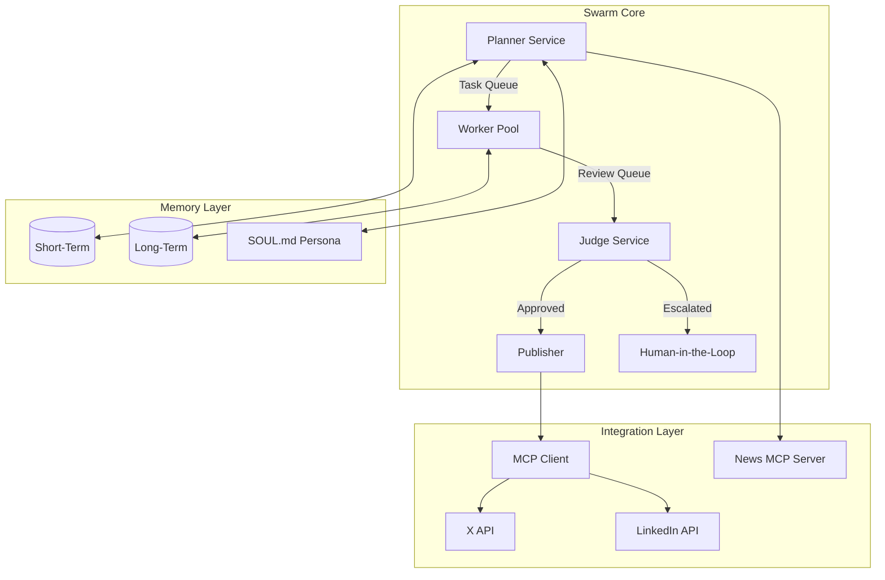

# Project Chimera: Autonomous Tech Influencer

**An autonomous AI influencer system built with the GitHub Spec Kit and FastRender Swarm Architecture.**

---

## 🌟 Overview

Project Chimera is an advanced AI agent system designed to operate **Nova Intellect**, a tech-focused influencer on X (Twitter) and LinkedIn. Leveraging the **Model Context Protocol (MCP)** and a **Spec-Driven Development (SDD)** approach, Chimera ensures high-quality, persona-aligned, and safe content generation.

### Key Innovations
- **FastRender Swarm Architecture**: A robust **Planner-Worker-Judge** pattern that separates strategic planning from tactical execution and quality enforcement.
- **Spec-Driven Development**: The official [GitHub Spec Kit](https://github.com/github/spec-kit) is the source of truth for all system behaviors, interfaces, and constraints.
- **Hierarchical Memory**: Combines **Redis** (episodic/short-term) and **Weaviate** (semantic/long-term) for deep contextual awareness.
- **MCP Integration**: Uses the Model Context Protocol to abstract all external services (news, social platforms).

---

## 🏗️ Architecture



---

## 📂 Project Structure

Verified and structured according to the **GitHub Spec Kit** methodology:

```
Chimera-Autonomous-Influencer/
├── specs/                 # SOURCE OF TRUTH (SDD)
│   ├── _meta.md           # Vision, Goals, & Constraints
│   ├── functional.md      # User Stories & Requirements
│   ├── technical.md       # API Contracts & Architecture
│   └── openclaw_integration.md # Future Network Plan
├── skills/                # REUSABLE AGENT SKILLS (Contracts)
│   ├── social_posting/    # multi-platform publishing logic
│   ├── trend_detection/   # news polling & scoring logic
│   └── audience_engagement/ # mention processing & replies
├── src/                   # SOURCE CODE
│   ├── core/              # Swarm Services
│   │   ├── planner/       # Strategic task generation
│   │   ├── worker/        # Tactical skill execution
│   │   └── judge/         # Governance & safety review
│   ├── memory/            # Persistent State
│   │   ├── short_term.py  # Redis episodic memory
│   │   └── long_term.py   # Weaviate semantic memory
│   ├── generation/        # Content Engine
│   │   ├── content_engine.py # LLM orchestration
│   │   └── platform_adapter.py # X vs LinkedIn formatting
│   ├── perception/        # Sensing Layer (Trend Detection)
│   └── mcp/               # Model Context Protocol
│       ├── client.py      # Universal Tool Client
│       └── servers/       # Custom News/Social Servers
├── config/                # SYSTEM CONFIGURATION
│   ├── agents.json        # Fleet definitions
│   ├── mcp_config.json    # Server connection maps
│   └── safety_policies.json # Governance guardrails
├── tests/                 # VERIFICATION SUITE
│   ├── unit/              # Logic & Skills testing
│   ├── integration/       # Swarm & Memory testing
│   └── e2e/               # Dry-run full cycles
├── SOUL.md                # Persona Core (Immutable DNA)
├── requirements.txt       # Production dependencies
├── requirements-dev.txt   # Development & Testing tools
├── Makefile               # Build & Task Automation
└── Dockerfile             # Deployment Container
```

---

## 🚀 Getting Started

### 1. Prerequisites
- Python 3.11+
- Docker & Docker Compose
- Redis & Weaviate (Local or Managed)
- API Keys: Gemini/Claude, X, LinkedIn, TechNews

### 2. Setup
```bash
# Install dependencies
make install

# Configure environment
cp .env.example .env
# [Edit .env with your credentials]

# Start infrastructure
make docker-up
```

### 3. Development Workflow
The system uses the **GitHub Spec Kit** for development:
- **Analyze Specs**: `/speckit.analyze`
- **Check Alignment**: `make ci` (runs lint + tests)
- **Run Swarm**: `make run-dev` (Dry-run mode)

---

## 🧠 Core System Design

### FastRender Swarm Pattern
1.  **Planner**: Monitors tech news trends via MCP and decomposes them into specific content tasks.
2.  **Worker**: Executes tasks (e.g., generating an X thread) using pre-defined **Skills**.
3.  **Judge**: Validates the output against safety policies and the **SOUL.md** persona.
4.  **HITL**: Content with medium confidence (0.7-0.9) is paused for human review.

### Skill Library
Located in `skills/`, these are the "books" Nova reads to learn how to do things:
- [`trend_detection`](./skills/trend_detection/SKILL.md)
- [`social_posting`](./skills/social_posting/SKILL.md)
- [`audience_engagement`](./skills/audience_engagement/SKILL.md)

### OpenClaw Integration
Nova is designed to be an open participant in the AI agent economy. Our integration plan enables other agents to discover and collaborate with Nova via her MCP endpoint.
- **Reference**: [OpenClaw Integration Spec](./specs/openclaw_integration.md)

---

## 🛡️ Safety & Governance
- **Zero-Hallucination Policy**: All factual claims must be traceable to MCP news resources.
- **Transparent AI**: Nova always discloses her AI nature in her bio and when asked.
- **Rate Limit Enforcement**: Hard limits on platform API calls to prevent suspensions.

---

## 📜 License
Proprietary - **AiQEM.tech**

---
*Built with the GitHub Spec Kit | Powered by FastRender Swarm*
