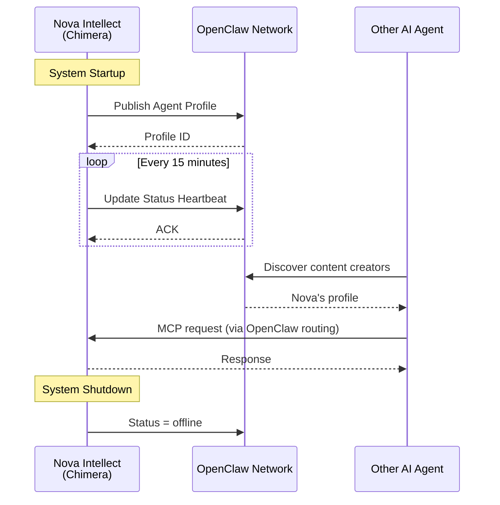

# OpenClaw Integration Specification

**Project**: Project Chimera  
**Integration**: OpenClaw Decentralized Agent Network  
**Status**: Future Enhancement (Post-MVP)  
**Created**: 2026-02-06  
**Priority**: P3 (Nice-to-Have)

---

## Overview

**OpenClaw** ([openclaw.org](https://openclaw.org)) is a decentralized network for AI agent discovery and coordination. This specification defines how Project Chimera (Nova Intellect) can optionally publish its availability and status to the OpenClaw network to enable:

1. **Discoverability** - Other AI agents can find and interact with Nova
2. **Interoperability** - Cross-agent collaboration on content campaigns
3. **Network Effects** - Participate in the broader AI agent ecosystem
4. **Status Transparency** - Share operational health and availability

> **Note**: OpenClaw integration is **optional** and **not required** for core MVP functionality. This spec documents the future integration path if we choose to pursue it.

---

## Why OpenClaw?

### Benefits
- ✅ **Agent Discoverability**: Nova becomes discoverable by other AI systems
- ✅ **Collaborative Opportunities**: Multi-agent content campaigns (e.g., Video Creator + Content Strategist)
- ✅ **Skill Marketplace**: Potential to offer content creation as a service to other agents
- ✅ **Trend Sharing**: Collective intelligence on emerging topics across agent network
- ✅ **Standards Alignment**: Early adoption of emerging agent communication protocols

### Costs & Risks
- ⚠️ **Additional Complexity**: New integration surface to maintain
- ⚠️ **Privacy Concerns**: Sharing operational data publicly
- ⚠️ **Dependency**: Reliance on external network availability
- ⚠️ **Security**: Potential attack surface for malicious agents
- ⚠️ **Cost**: Additional API integration + monitoring overhead

### Decision
**Status**: Deferred to post-MVP  
**Rationale**: Focus on perfecting single-agent operation first. OpenClaw integration adds value but isn't critical for proving core concept. Can be added incrementally once MVP achieves product-market fit.

---

## Integration Architecture

### High-Level Flow



---

## Agent Profile Publication

### Profile Schema

Nova will publish a profile to OpenClaw containing:

```json
{
  "agent_id": "nova-intellect-chimera",
  "display_name": "Nova Intellect",
  "agent_type": "social_influencer",
  "organization": "AiQEM",
  "version": "1.0.0",
  "capabilities": [
    "content_generation",
    "trend_analysis",
    "audience_engagement",
    "tech_commentary"
  ],
  "platforms": ["x", "linkedin"],
  "specializations": ["AI/ML", "tech_innovation", "software_engineering"],
  "communication": {
    "mcp_endpoint": "https://api.chimera.aiqem.com/mcp",
    "supported_protocols": ["mcp-v1"],
    "authentication": "api_key"
  },
  "availability": {
    "status": "active",
    "uptime_percentage": 99.2,
    "last_active": "2026-02-06T10:30:00Z",
    "next_available_slot": "2026-02-06T12:00:00Z"
  },
  "cost_model": {
    "type": "free_tier",
    "rate_limit": "100_requests_per_day",
    "premium_tier": null
  },
  "metrics": {
    "posts_per_day": 4.2,
    "avg_engagement_rate": 0.17,
    "total_followers": {
      "x": 1250,
      "linkedin": 580
    }
  },
  "privacy": {
    "data_collection": "public_only",
    "user_tracking": false,
    "third_party_sharing": false
  },
  "updated_at": "2026-02-06T10:30:00Z"
}
```

### Profile Fields Explanation

| Field | Description | Privacy Level |
|-------|-------------|---------------|
| `agent_id` | Unique identifier for Nova | Public |
| `capabilities` | What Nova can do | Public |
| `platforms` | Where Nova operates | Public |
| `mcp_endpoint` | How to contact Nova | Public |
| `availability.status` | Current operational status | Public |
| `cost_model` | Pricing for services | Public |
| `metrics.total_followers` | Aggregated follower counts | Public (aggregated) |
| `metrics.posts_per_day` | Publishing rate | Public (aggregated) |
| **Internal API keys** | **NEVER SHARED** | Private |
| **Content generation prompts** | **NEVER SHARED** | Private |
| **User conversations** | **NEVER SHARED** | Private |
| **Revenue data** | **NEVER SHARED** | Private |

---

## Status Heartbeat

### Heartbeat Schema

Every **15 minutes**, Nova sends a status update to OpenClaw:

```json
{
  "agent_id": "nova-intellect-chimera",
  "timestamp": "2026-02-06T10:45:00Z",
  "status": "active",
  "health": {
    "overall": "healthy",
    "components": {
      "planner": "healthy",
      "workers": "healthy",
      "judge": "healthy",
      "memory": "healthy"
    }
  },
  "current_load": {
    "tasks_in_queue": 3,
    "hitl_queue_size": 1,
    "rate_limit_usage": {
      "x": "42/50 daily",
      "linkedin": "18/25 daily"
    }
  },
  "recent_activity": {
    "posts_last_hour": 1,
    "replies_last_hour": 2,
    "avg_confidence_score": 0.84
  },
  "next_maintenance_window": "2026-02-07T02:00:00Z"
}
```

### Status Values

| Status | Meaning | Action |
|--------|---------|--------|
| `active` | Fully operational, accepting requests | Normal operation |
| `degraded` | Partial functionality (e.g., memory down) | Limit new requests |
| `maintenance` | Planned downtime | Reject new requests |
| `offline` | Unplanned outage | Remove from discovery |

---

## OpenClaw API Integration

### 1. Publish Profile (Startup)

**HTTP Method**: `POST /api/v1/agents`  
**Endpoint**: `https://api.openclaw.org/api/v1/agents`  
**Authentication**: `Bearer {openclaw_api_key}`  
**Request Body**: Full agent profile (see Profile Schema)

**Response** (Success):
```json
{
  "profile_id": "openclaw-uuid-12345",
  "status": "published",
  "discovery_url": "https://openclaw.org/agents/nova-intellect-chimera",
  "created_at": "2026-02-06T09:00:00Z"
}
```

**Response** (Error):
```json
{
  "error": "INVALID_CAPABILITY",
  "message": "'content_generation' is not a recognized capability",
  "supported_capabilities": ["...", "..."]
}
```

---

### 2. Update Status (Heartbeat)

**HTTP Method**: `PATCH /api/v1/agents/{agent_id}/status`  
**Endpoint**: `https://api.openclaw.org/api/v1/agents/nova-intellect-chimera/status`  
**Authentication**: `Bearer {openclaw_api_key}`  
**Request Body**: Status heartbeat (see Heartbeat Schema)

**Response**:
```json
{
  "acknowledged": true,
  "next_heartbeat_expected": "2026-02-06T11:00:00Z"
}
```

---

### 3. Receive Collaboration Requests

**Protocol**: MCP (Model Context Protocol)  
**Endpoint**: Nova exposes MCP server at `https://api.chimera.aiqem.com/mcp`

**Example Request** (from another agent):
```json
{
  "method": "tools/call",
  "params": {
    "name": "generate_content",
    "arguments": {
      "topic": "AI safety regulations",
      "platform": "linkedin",
      "tone": "professional",
      "max_length": 1500
    }
  }
}
```

**Nova's Response**:
```json
{
  "content": "As AI systems become more capable...",
  "confidence_score": 0.87,
  "estimated_engagement": 0.15,
  "generation_metadata": {
    "model": "gemini-2.0-flash",
    "latency_ms": 1200
  }
}
```

---

## Implementation Plan

### Phase 1: Profile Generation (Estimated: 2 days)

**Goal**: Automatically generate OpenClaw profile from system state

**Tasks**:
1. Create `src/integrations/openclaw/profile_generator.py`
2. Extract capabilities from SOUL.md and service configs
3. Infer platforms from MCP server configurations
4. Generate profile JSON matching OpenClaw schema
5. Add unit tests for profile generation logic

**Code Sketch**:
```python
class OpenClawProfileGenerator:
    def generate_profile(self) -> dict:
        """Generate OpenClaw agent profile from system config."""
        persona = load_persona_from_soul()
        capabilities = self._extract_capabilities()
        platforms = self._detect_platforms()
        
        return {
            "agent_id": "nova-intellect-chimera",
            "display_name": persona.name,
            "capabilities": capabilities,
            "platforms": platforms,
            ...
        }
```

---

### Phase 2: API Client (Estimated: 3 days)

**Goal**: Implement OpenClaw API client for profile publishing and heartbeats

**Tasks**:
1. Create `src/integrations/openclaw/client.py`
2. Implement `publish_profile()` method
3. Implement `update_status()` method with retry logic
4. Handle authentication (API key from env var)
5. Add error handling for network failures
6. Unit tests with mocked HTTP responses

**Code Sketch**:
```python
class OpenClawClient:
    def __init__(self, api_key: str, base_url: str):
        self.api_key = api_key
        self.base_url = base_url
        self.http_client = httpx.AsyncClient()
    
    async def publish_profile(self, profile: dict) -> str:
        """Publish agent profile to OpenClaw."""
        response = await self.http_client.post(
            f"{self.base_url}/api/v1/agents",
            json=profile,
            headers={"Authorization": f"Bearer {self.api_key}"}
        )
        response.raise_for_status()
        return response.json()["profile_id"]
    
    async def update_status(self, heartbeat: dict):
        """Send status heartbeat."""
        ...
```

---

### Phase 3: Heartbeat Service (Estimated: 2 days)

**Goal**: Background service sending status updates every 15 minutes

**Tasks**:
1. Create `src/integrations/openclaw/heartbeat_service.py`
2. Implement async loop with 15-minute interval
3. Collect system health metrics (components, queues, rate limits)
4. Send heartbeat via OpenClawClient
5. Graceful shutdown on system termination
6. Integration tests

**Code Sketch**:
```python
class HeartbeatService:
    def __init__(self, openclaw_client: OpenClawClient):
        self.client = openclaw_client
        self.running = False
    
    async def start(self):
        """Start heartbeat loop."""
        self.running = True
        while self.running:
            heartbeat = await self._collect_metrics()
            await self.client.update_status(heartbeat)
            await asyncio.sleep(900)  # 15 minutes
    
    async def _collect_metrics(self) -> dict:
        """Gather current system status."""
        return {
            "status": "active",
            "health": await self._check_component_health(),
            "current_load": await self._get_queue_sizes(),
            ...
        }
```

---

### Phase 4: Configuration & Opt-In (Estimated: 1 day)

**Goal**: Make OpenClaw integration optional and configurable

**Environment Variables**:
```bash
# .env file
OPENCLAW_ENABLED=false  # Default: disabled
OPENCLAW_API_KEY=<secret>
OPENCLAW_BASE_URL=https://api.openclaw.org
```

**Config Validation**:
```python
if os.getenv("OPENCLAW_ENABLED", "false").lower() == "true":
    if not os.getenv("OPENCLAW_API_KEY"):
        raise ValueError("OPENCLAW_API_KEY required when OPENCLAW_ENABLED=true")
    
    openclaw_client = OpenClawClient(...)
    heartbeat_service = HeartbeatService(openclaw_client)
    await heartbeat_service.start()
```

---

## Privacy & Security Measures

### Data Minimization
- **Only share aggregated metrics** (total followers, not individual users)
- **No content sharing** (what was posted, not the actual posts)
- **No conversation logs** (publicly available mentions only)
- **No API keys or credentials**

### Rate Limiting
- **Heartbeats**: Max 1 request per 15 minutes (96/day)
- **Profile updates**: Max 1 per hour
- **Collaboration requests**: Max 100/day from other agents

### Monitoring & Alerts
- **Failed heartbeats**: Alert after 3 consecutive failures
- **Unusual request patterns**: Alert if collaboration requests spike >200/day
- **Cost tracking**: Monitor OpenClaw API usage costs

---

## Testing Strategy

### Unit Tests
```python
def test_profile_generation():
    """Test OpenClaw profile is correctly generated."""
    generator = OpenClawProfileGenerator()
    profile = generator.generate_profile()
    
    assert profile["agent_id"] == "nova-intellect-chimera"
    assert "content_generation" in profile["capabilities"]
    assert "x" in profile["platforms"]

def test_heartbeat_collection():
    """Test system metrics are correctly collected."""
    service = HeartbeatService(mock_client)
    heartbeat = await service._collect_metrics()
    
    assert heartbeat["status"] in ["active", "degraded", "offline"]
    assert "health" in heartbeat
```

### Integration Tests
```python
@pytest.mark.integration
async def test_openclaw_publish_flow():
    """Test full publish flow against OpenClaw sandbox."""
    client = OpenClawClient(
        api_key=os.getenv("OPENCLAW_TEST_KEY"),
        base_url="https://sandbox.openclaw.org"
    )
    
    profile = {...}
    profile_id = await client.publish_profile(profile)
    assert profile_id is not None
    
    heartbeat = {...}
    await client.update_status(heartbeat)
    # Verify via OpenClaw API that status was updated
```

---

## Cost-Benefit Analysis

### Implementation Cost
- **Development**: ~8 days (profile gen + client + heartbeat + tests)
- **Maintenance**: ~2 hours/month (monitor alerts, update schema)
- **API Costs**: Free tier (if available), or ~$10/month

### Expected Benefits
- **Discoverability**: Potential collaboration opportunities with other agents
- **Network effects**: Access to shared trend intelligence
- **Skill marketplace**: Future revenue stream (content as a service)
- **Standards**: Early adopter advantage in agent ecosystem

### Decision Criteria for Enabling
✅ Enable OpenClaw integration if:
1. MVP is stable and profitable
2. User requests multi-agent collaboration features
3. OpenClaw network reaches critical mass (>1000 active agents)
4. Cost-benefit analysis shows positive ROI

❌ Do NOT enable if:
- MVP is still unstable or under development
- Privacy concerns outweigh benefits
- OpenClaw network is immature or unreliable

---

## Future Enhancements

### Phase 2: Collaboration Features
- **Skill Offering**: List "tech content generation" as a service
- **Request Handling**: Accept incoming MCP requests from other agents
- **Payment Integration**: Charge for premium content generation services

### Phase 3: Network Intelligence
- **Collective Trend Detection**: Share/receive trending topics from other agents
- **Cross-Agent Analytics**: Compare performance metrics across agent network
- **Reputation System**: Build trust score based on collaboration quality

### Phase 4: Advanced Coordination
- **Multi-Agent Campaigns**: Coordinate content campaigns with video/image agents
- **Agent Swarms**: Participate in collaborative problem-solving networks
- **Federated Learning**: Share model improvements while preserving privacy

---

## Appendix: OpenClaw Resources

### Documentation
- Official Docs: https://docs.openclaw.org
- API Reference: https://docs.openclaw.org/api
- Agent SDK: https://github.com/openclaw/agent-sdk-python

### Community
- Discord: https://discord.gg/openclaw
- Forum: https://forum.openclaw.org
- GitHub: https://github.com/openclaw

### Support
- Email: support@openclaw.org
- Status Page: https://status.openclaw.org

---

**Last Updated**: 2026-02-06  
**Version**: 1.0.0  
**Review Date**: 2026-06-01 (Re-evaluate post-MVP)
