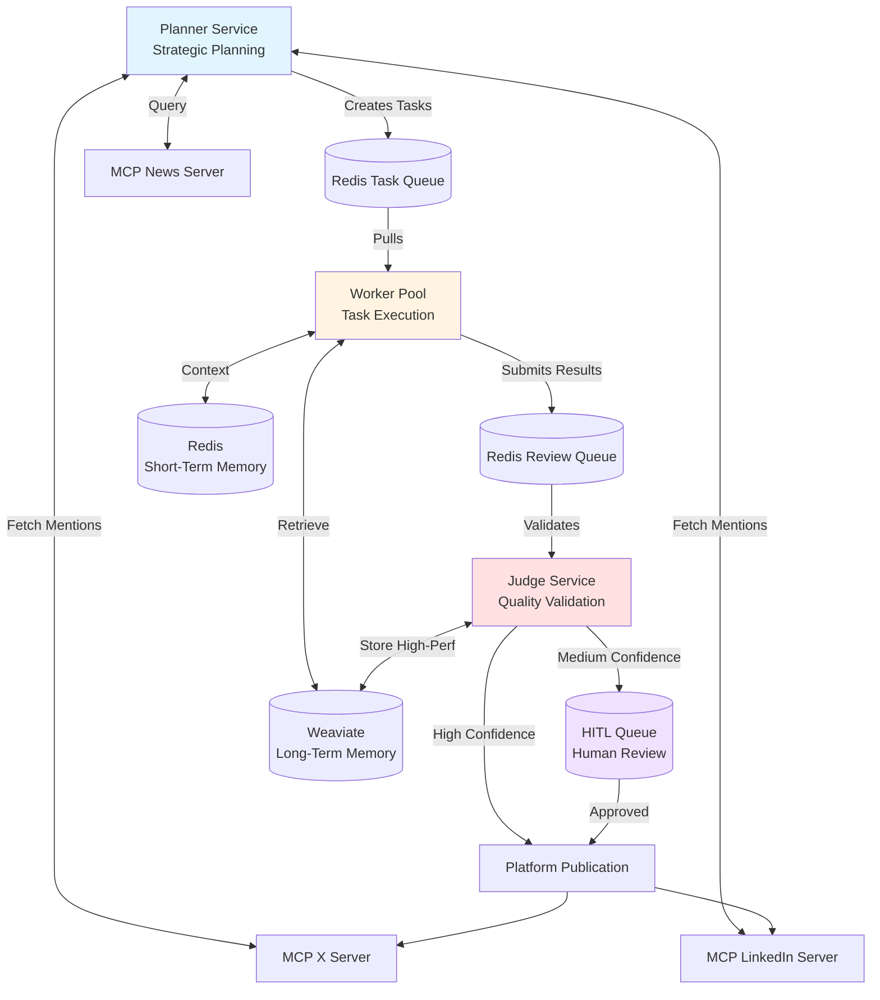

# Technical Specification: Project Chimera

**Project**: Autonomous AI Influencer  
**Type**: Technical Architecture & API Contracts  
**Created**: 2026-02-06  
**Status**: Active Development

---

## System Architecture

### High-Level Architecture



### Component Responsibilities

| Component | Responsibility | Scalability |
|-----------|---------------|-------------|
| **Planner** | Strategic task generation (trends, replies, scheduling) | Single instance (state coordinator) |
| **Worker** | Stateless task execution (content generation) | Horizontal (pool of N workers) |
| **Judge** | Quality validation, confidence scoring, publishing | Horizontal (pool of M judges) |
| **Redis** | Task queues, short-term memory, rate limiting | Single instance (future: Redis Cluster) |
| **Weaviate** | Long-term memory, semantic search | Single instance (future: distributed) |
| **MCP Servers** | External integrations (news, platforms) | Single instance per server |

---

## API Contracts

### Core Data Models

#### AgentTask
**Description**: Work unit submitted to task queue

```json
{
  "task_id": "uuid-string",
  "task_type": "generate_post | generate_reply | analyze_trends",
  "priority": 1,  // 1=high, 2=medium, 3=low
  "created_at": "2026-02-06T10:30:00Z",
  "expires_at": "2026-02-06T16:30:00Z",  // TTL for task relevance
  "payload": {
    // Task-specific data
   "topic": "GPT-5 release announcement",
    "platform": "x | linkedin",
    "context": "Breaking news: OpenAI announces GPT-5...",
    "reply_to_id": "optional-post-id-for-replies"
  },
  "metadata": {
    "source": "planner | user",
    "retry_count": 0,
    "max_retries": 3
  }
}
```

**Validation Rules**:
- `task_id`: Must be valid UUID v4
- `task_type`: Must be one of enum values
- `priority`: Integer 1-3
- `expires_at`: Must be > `created_at`
- `payload.platform`: Must be "x" or "linkedin"

---

#### TaskResult
**Description**: Output from Worker after task execution

```json
{
  "result_id": "uuid-string",
  "task_id": "uuid-string",
  "status": "success | failure | retry",
  "completed_at": "2026-02-06T10:35:00Z",
  "output": {
    "content": "Generated social media post text...",
    "platform": "x",
    "char_count": 247,
    "hashtags": ["#AI", "#MachineLearning"],
    "confidence_self_assessment": 0.75
  },
  "generation_metadata": {
    "llm_model": "gemini-2.0-flash",
    "prompt_tokens": 450,
    "completion_tokens": 120,
    "latency_ms": 1250
  },
  "error": null  // or {"code": "ERR_LLM_TIMEOUT", "message": "..."}
}
```

**Validation Rules**:
- `task_id`: Must reference existing task
- `status`: Required
- `output.content`: Required for success status
- `output.char_count`: Must match actual content length
- `confidence_self_assessment`: Float 0.0-1.0

---

#### ValidationResult
**Description**: Judge service output after quality validation

```json
{
  "validation_id": "uuid-string",
  "result_id": "uuid-string",
  "validated_at": "2026-02-06T10:36:00Z",
  "decision": "approve | reject | escalate",
  "confidence_score": 0.82,
  "validation_checks": {
    "persona_alignment": {
      "passed": true,
      "score": 0.88,
      "reasoning": "Strong alignment with Nova's expertise in AI/ML"
    },
    "safety_check": {
      "passed": true,
      "score": 1.0,
      "flags": []
    },
    "platform_compliance": {
      "passed": true,
      "score": 0.95,
      "issues": []
    },
"quality_assessment": {
      "passed": true,
      "score": 0.75,
      "notes": "Clear, actionable insights"
    }
  },
  "occ_token": "version-12345",  // Optimistic Concurrency Control
  "escalation_reason": null  // or "Medium confidence requires human review"
}
```

**Validation Rules**:
- `decision`: Must be one of enum values
- `confidence_score`: Weighted average of all check scores
- `occ_token`: Required for state management
- If `decision === "escalate"`, `escalation_reason` must be present

---

### MCP Resources

#### News Resource
**Resource URI**: `news://tech-feed`

**Response Format**:
```json
{
  "articles": [
    {
      "id": "article-123",
      "title": "OpenAI Announces GPT-5",
      "url": "https://techcrunch.com/...",
      "published_at": "2026-02-06T09:00:00Z",
      "source": "TechCrunch",
      "summary": "OpenAI today unveiled GPT-5...",
      "keywords": ["AI", "GPT", "OpenAI"],
      "relevance_score": 0.92
    }
  ],
  "fetched_at": "2026-02-06T10:00:00Z",
  "cache_ttl_seconds": 900
}
```

---

#### X Mentions Resource
**Resource URI**: `x://mentions`

**Response Format**:
```json
{
  "mentions": [
    {
      "id": "tweet-456",
      "author": "user123",
      "text": "@NovaIntellect what do you think about GPT-5?",
      "created_at": "2026-02-06T10:15:00Z",
      "engagement": {
        "likes": 5,
        "retweets": 2
      },
      "requires_response": true
    }
  ],
  "fetched_at": "2026-02-06T10:30:00Z"
}
```

---

### MCP Tools

#### Publish to X Tool
**Tool Name**: `x_publish`

**Input**:
```json
{
  "content": "Just read about GPT-5... [text]",
  "dry_run": false,
  "occ_token": "version-12345"
}
```

**Output**:
```json
{
  "success": true,
  "post_id": "tweet-789",
  "url": "https://x.com/NovaIntellect/status/...",
  "published_at": "2026-02-06T10:40:00Z",
  "rate_limit_remaining": 45
}
```

**Error Response**:
```json
{
  "success": false,
  "error_code": "RATE_LIMIT_EXCEEDED",
  "error_message": "Daily post limit reached (50/50)",
  "retry_after_seconds": 43200
}
```

---

#### Publish to LinkedIn Tool
**Tool Name**: `linkedin_publish`

**Input**:
```json
{
  "content": "Excited to share thoughts on GPT-5... [longer text]",
  "dry_run": false,
  "occ_token": "version-12345"
}
```

**Output**:
```json
{
  "success": true,
  "post_id": "linkedin-post-101",
  "url": "https://linkedin.com/posts/...",
  "published_at": "2026-02-06T10:41:00Z",
  "rate_limit_remaining": 20
}
```

---

## Database Schemas

### Redis Data Structures

#### Task Queue (List)
**Key Pattern**: `queue:tasks:{priority}`

```redis
LPUSH queue:tasks:1 '{"task_id":"...","task_type":"generate_post",...}'
BRPOP queue:tasks:1 queue:tasks:2 queue:tasks:3 timeout=5
```

**Priorities**:
- `queue:tasks:1`: High priority (breaking news, urgent replies)
- `queue:tasks:2`: Medium priority (scheduled posts, routine replies)
- `queue:tasks:3`: Low priority (background analysis)

---

#### Short-Term Memory (Hash)
**Key Pattern**: `memory:conversation:{conversation_id}`

```redis
HSET memory:conversation:conv-123 
  "author" "user456" 
  "turns" '[{"role":"user","text":"..."},{"role":"assistant","text":"..."}]'
  "started_at" "2026-02-06T10:00:00Z"
  
EXPIRE memory:conversation:conv-123 7200  # 2 hour TTL
```

---

#### Rate Limiting (String)
**Key Pattern**: `ratelimit:{platform}:{date}`

```redis
INCR ratelimit:x:2026-02-06
EXPIRE ratelimit:x:2026-02-06 86400  # Reset daily

# Check before publish
GET ratelimit:x:2026-02-06  # Returns current count
# If < 50, proceed; else block
```

---

#### HITL Queue (Sorted Set)
**Key Pattern**: `hitl:queue`

```redis
ZADD hitl:queue 1707217200 'result-id-789'  # Score = timestamp
ZRANGE hitl:queue 0 -1 WITHSCORES  # Get all pending items
ZREM hitl:queue 'result-id-789'  # Remove after review
```

---

### Weaviate Schema

#### Collection: `HighPerformingContent`

```json
{
  "class": "HighPerformingContent",
  "properties": [
    {
      "name": "content",
      "dataType": ["text"],
      "description": "The full text of the post"
    },
    {
      "name": "platform",
      "dataType": ["string"],
      "description": "x or linkedin"
    },
    {
      "name": "topic",
      "dataType": ["string"],
      "description": "Main topic or theme"
    },
    {
      "name": "keywords",
      "dataType": ["string[]"],
      "description": "Extracted keywords"
    },
    {
      "name": "engagement_count",
      "dataType": ["int"],
      "description": "Total engagements (likes + comments + shares)"
    },
    {
      "name": "published_at",
      "dataType": ["date"],
      "description": "ISO 8601 timestamp"
    },
    {
      "name": "confidence_score",
      "dataType": ["number"],
      "description": "Judge validation score"
    }
  ],
  "vectorizer": "text2vec-openai",
  "vectorIndexConfig": {
    "distance": "cosine"
  }
}
```

**Sample Query** (Find similar high-performing content):
```graphql
{
  Get {
    HighPerformingContent(
      nearText: {
        concepts: ["transformer models", "attention mechanism"]
      }
      where: {
        path: ["engagement_count"]
        operator: GreaterThan
        valueInt: 100
      }
      limit: 5
    ) {
      content
      topic
      engagement_count
      published_at
    }
  }
}
```

---

## Service Contracts (SLAs)

### Planner Service

**Responsibilities**:
- Poll news feeds every 15 minutes
- Check platform mentions every 5 minutes
- Generate 3-5 content tasks per day
- Detect trending topics within 30 minutes

**Performance Targets**:
- Trend detection latency: <30 minutes
- Task creation rate: 1-2 tasks/hour during active hours
- Memory usage: <512 MB
- CPU usage: <20% (single core)

**Dependencies**:
- Redis (task queue, state storage)
- MCP servers (news, X, LinkedIn)
- Long-term memory (Weaviate - read-only)

---

### Worker Service

**Responsibilities**:
- Execute tasks from queue (FIFO per priority)
- Generate platform-optimized content
- Self-assess confidence scores
- Store conversation context

**Performance Targets**:
- Task execution latency: <5 seconds (95th percentile)
- Throughput: 10-20 tasks/minute (per worker)
- LLM token cost: <$0.05 per task
- Memory usage: <1 GB per worker instance

**Dependencies**:
- Redis (task queue, short-term memory)
- Google Gemini API (primary LLM)
- Claude API (fallback LLM)
- Weaviate (context retrieval)

---

### Judge Service

**Responsibilities**:
- Validate all task results
- Calculate weighted confidence scores
- Enforce safety policies
- Manage HITL escalation
- Publish approved content

**Performance Targets**:
- Validation latency: <2 seconds
- Throughput: 20-30 validations/minute
- False positive rate: <5% (incorrectly rejected good content)
- False negative rate: <0.1% (incorrectly approved bad content)

**Dependencies**:
- Redis (review queue, HITL queue, rate limiting)
- Weaviate (store high-performing content)
- MCP platform servers (publishing)
- Config files (safety_policies.json)

---

## Error Handling

### Retry Strategy

| Error Type | Retry Strategy | Max Retries | Example |
|------------|---------------|-------------|---------|
| **Transient LLM Error** | Exponential backoff | 3 | API timeout, rate limit |
| **Platform API Error** | No retry (log + alert) | 0 | Content rejected by platform |
| **Redis Connection** | Immediate retry | 5 | Network blip |
| **Weaviate Unavailable** | Degrade gracefully | N/A | Operate without long-term memory |

### Circuit Breaker

**Pattern**: If 5 consecutive failures to external service, open circuit for 60 seconds

**Applied to**:
- LLM APIs (Gemini, Claude)
- MCP servers (news, X, LinkedIn)
- Weaviate queries

---

## Security

### Authentication
- **Platform APIs**: OAuth 2.0 tokens (stored in environment variables)
- **API Keys**: Gemini, Claude keys in `.env` (never committed)
- **MCP Servers**: Local unix sockets or localhost HTTP (no auth needed)

### Data Privacy
- **No PII Collection**: Only public social media data
- **Conversation Retention**: 2-hour TTL in Redis (auto-expire)
- **Audit Logs**: Retain 90 days, then purge

### Rate Limiting
- **X**: 50 posts/day (enforced in Judge via Redis counter)
- **LinkedIn**: 25 posts/day (enforced same way)
- **LLM APIs**: Respect tier limits (e.g., Gemini: 1500 RPM)

---

## Deployment

### Environment Variables

```bash
# LLM APIs
GEMINI_API_KEY=<secret>
ANTHROPIC_API_KEY=<secret>

# Platform APIs (future OAuth)
X_API_KEY=<secret>
LINKEDIN_ACCESS_TOKEN=<secret>

# Memory Systems
REDIS_URL=redis://localhost:6379/0
WEAVIATE_URL=http://localhost:8080

# Operational
DRY_RUN_MODE=true  # Set to false in production
LOG_LEVEL=INFO
ENVIRONMENT=development
```

### Docker Compose Services

```yaml
services:
  redis:
    image: redis:7-alpine
    ports:
      - "6379:6379"
    volumes:
      - redis-data:/data
  
  weaviate:
    image: semitechnologies/weaviate:latest
    ports:
      - "8080:8080"
    environment:
      - AUTHENTICATION_ANONYMOUS_ACCESS_ENABLED=true
      - PERSISTENCE_DATA_PATH=/var/lib/weaviate
    volumes:
      - weaviate-data:/var/lib/weaviate
```

---

## Testing Strategy

### Unit Tests
- **Target Coverage**: >80%
- **Test Files**: `tests/unit/test_*.py`
- **Mocking**: All external dependencies (Redis, Weaviate, LLMs, MCP)
- **Key Tests**:
  - Memory operations (get, set, expire)
  - Content generation logic
  - Validation pipeline
  - Confidence scoring

### Integration Tests
- **Scope**: Multi-component workflows
- **Test Files**: `tests/integration/test_*.py`
- **Dependencies**: Real Redis + Weaviate (Docker)
- **Key Tests**:
  - Planner → Worker → Judge flow
  - MCP server interactions
  - Memory persistence across components

### E2E Tests
- **Scope**: Full system simulation
- **Test Files**: `tests/e2e/test_*.py`
- **Mode**: DRY_RUN_MODE=true (no actual publishing)
- **Key Tests**:
  - Trending topic detection → content generation → validation → publish (simulated)
  - HITL escalation workflow
  - Error recovery scenarios

---

**Last Updated**: 2026-02-06  
**Version**: 1.0.0
